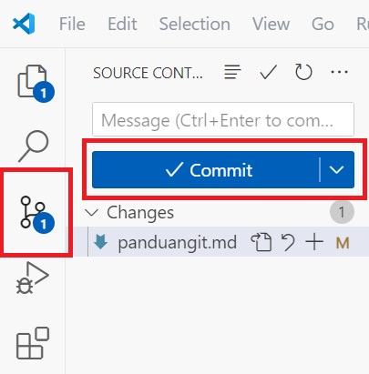
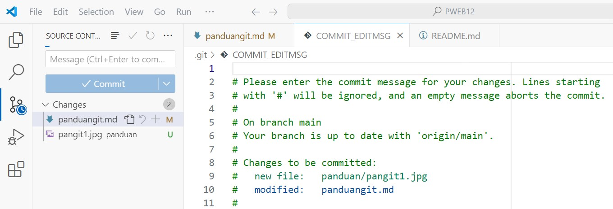
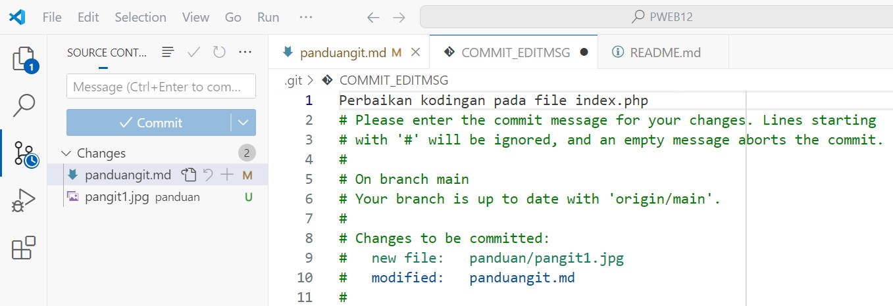
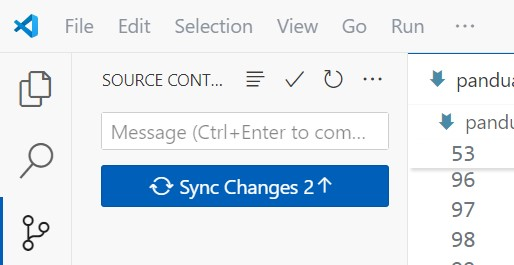

# Panduan Penggunaan Git dan Github

1. Pertama, buka www.github.com pada web browser
2. Lalu, daftar (sign up) menggunakan email yang anda miliki
3. lalu login (sign in) menggunakan akun github yang sudah didaftarkan sebelumnya
4. Jika tidak punya, anda boleh menngunakan akun github milik saya

   Akun :
   username : ahmadmaldin
   email : ahmad.mauludin247@guru.smk.belajar.id
   password : SaheelaMeera69

5. **Buat repositori baru**, beri nama sesuai nama projek (saran : menggunakan nama dinas).
6. **Install aplikasi git** yang dapat anda download di situs resminya https://git-scm.com/ lalu instal.
7. Setelah git terinstall, **Buka file manager**, arahkan ke Folder **htdocs**.
8. Buka terminal git dengan cara **klik kanan > open gitbash here**
9. **Inisiasikan username** github, caranya ketikan

```
git config --global user.name "ahmadmaldin"
```

10. **Inisiasikan useremail** github, caranya ketikan

```
git config --global user.email ahmad.mauludin247@guru.smk.belajar.id
```

11. Cek hasil confignya, caranya ketik

```
git config —list
```

12. Baca teks yang muncul, Jika username dan emailnya sudah sesuai, maka tandanya git anda sudah tertaut dengan github.
13. Unduh atau clone repositori github ke komputer, caranya ketik

```
git clone https://github.com/username/namarepositori.git namarepositori
```

14. Lalu lihat pada file manager, maka akan ada folder repositori yang sebelumnya dikloning. Lalu masuk ke folder tersebut.
15. Close terminal gitbash nya, lalu buka lagi. (Jika tidak mau diclose, bisa ketik `cd namafolderrepositori` maka terminal akan berpindah ke dalam repositori tersebut).

- **Perbarui repository** yang telah diunduh ke dalam komputer menggunakan perintah `git pull` contoh:

```
git pull origin main
```

memperbaharui repositori pada komputer hanya dilakukan ketika anda baru membuka lagi komputer, dan sebelumnya anda pernah melakukan perubahan pada komputer yang lain.

# Penggunaan Lanjutan

Selanjutnya dalam mengelola direktori ada 2 cara yang dapat dilakukan untuk melakukan update/pembaharuan file, folder, atau data pada repositori, yaitu menggunakan terminal gitbash atau langsung di dalam aplikasi vscode.

**Jika menggunakan terminal gitbash,** pada setiap selesai mengerjakan projek, silahkan gunakan kode berikut untuk memperbaharui repositori, agar repositori anda sesuia antara di lokal/pc dan github.

- **Mengunggah Perubahan**

Jangan lupa untuk melakukan pull terlebih dahulu sebelum melakukan push.

- **Tambah file baru atau ubah file**

```
git add <nama file>
```

- **Tambah beberapa file baru atau ubah beberapa file sekaligus**

```
git add .
```

- **Konfirmasi penambahan atau perubahan file**

```
git commit -m "<pesan commit>"
```

- **Ubah dan konfirmasi modifikasi beberapa file sekaligus**

```
git commit -a -m "<pesan commit>"
```

- **Kirim perubahan ke dalam repository**

```
git push origin main
```

atau

```
git push -u origin main
```

Setelah melakukan push pertama kali, terkadang akan muncul popup dari browser untuk melakukan login ke dalam akun github melalui browser, maka lakukan login dengan menggunakan email/username dan password github yang sudah anda inisiasikan sebelumnya. juga terkadang github meminta kode konfirmasi yang terdiri dari 6 digit angka yang dikirim oleh github ke email yang digunakan akun github tersebut. (jika menggunakan email saya, silahkan tanyakan kepada saya)

**Jika langsung di vscode,** pada setiap **selesai mengerjakan projek**, silahkan perhatikan langkah berikut untuk memperbaharui repositori, agar repositori anda sesuai antara di lokal/pc dan github.

1. Buka aplikasi vscode, lalu open folder.
2. Pilih folder projek / repositori hasil unduhan/clone dari github anda.
3. Lakukan pekerjaan coding anda seperti biasa. Setiap ada perubahan di dalam folder projek repositori yang anda kelola (baik itu menambah, menghapus dan mengubah apapun) pasti muncul tanda biru berisi angka pada icon fork, dan ketika di klik, maka akan muncul tombol **Commit** berwarna biru yang aktif.

   

4. Klik tombol Commit tersebut, lalu vscode akan otomatis membuka file COMMIT_EDITMSG

   

5. Ketikan pesan pada baris pertama mengenai perubahan apa yang anda lakukan pada projek anda agar suatu saat anda mengetahui perubahan terakhir dari projek, namun itu hanya bersifat opsional, sebenarnya anda juga boleh mengisi pesan apapun.

   

6. Setelah diketikan, lalu save `ctrl + s` dan close file COMMIT_EDITMSG tersebut., maka nanti tombol Commit akan berubah menjadi **Sync Changes** dan tanda biru berangka pada icon fork akan hilang.

   

7. Lalu klik tombol tersebut, itu menandakan bahwa antara repositori lokal pada komputer dan repositori pada github anda sudah sesuai.

Sama halnya dengan proses push menggunakan terminal gitbash, Setelah melakukan push pertama kali, terkadang akan muncul popup dari browser untuk melakukan login, maka lakukan langkah seperti pada panduan di atas. namun setelahnya anda tidak akan diminta lagi untuk login ke github selama masih menggunakan komputer yang sama.

## Mengecek Perubahan

Untuk melihat perubahannya silahkan buka kembali repositori anda pada github, dan cek apakah terjadi perubahan sesuai apa yang anda kerjakan pada repositori lokal di komputer.

## Panduan Lainnya

Untuk panduan lanjutan alangkah baiknya anda pelajari pada sumber berikut :

- Dokumentasi pengunaan git https://git-scm.com/book/id/v2
- Panduan Ringkas https://rogerdudler.github.io/git-guide/index.id.html
- Panduan Lain https://www.geeksforgeeks.org/git-cheat-sheet/
- Panduan Simpel https://github.com/datascienceid/panduan-github

Dan masih banyak lagi panduan yang dapat anda jelajahi di internet, silahkan.
